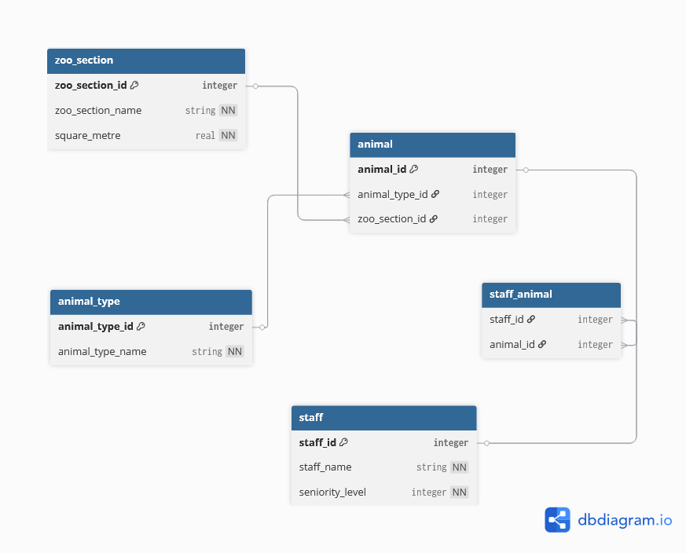

# Version 1 13th November DMS

Python Database Management System (DMS). Completed as part of Digital Training for Version 1:

Zoo Data Management. Contains animals, staff and zoo sections. Interacting with Python script through the terminal, users can perform CRUD operations on data.

zoo.db (database) will be created relative to the default Python workspace configured on your machine, in a '13th_november_version1_DMS' directory.

## Entity-Relationship Diagram (ERD)

## Test

With `pytest` installed, run this command in **Default Python Workspace directory**

> python -m pytest -s .\13th_november_version1_DMS\test_database.py
